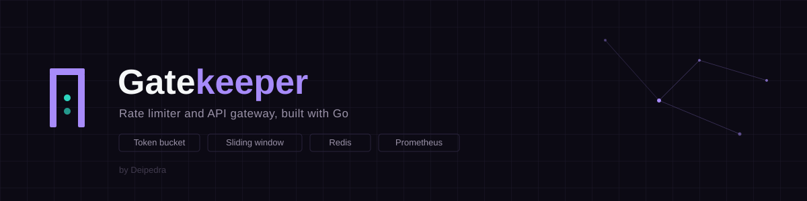
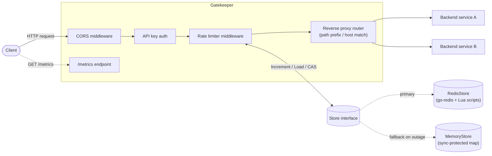

<p align="center">
  
</p>

# Gatekeeper

Gatekeeper is a rate limiter and API gateway written in Go. It sits in front of your backend services, decides which requests get through based on per-client limits, and proxies the rest to wherever they're supposed to go. Metrics and graceful degradation come standard, not bolted on afterward.

I built it as a reference implementation more than a one-off tool. All three rate-limiting algorithms you'd actually reach for in production — Token Bucket, Sliding Window Log, Fixed Window Counter — run against the same storage abstraction, so switching one for another (or memory for Redis) is a config change, not a rewrite.

## Features

- **Three pluggable rate-limiting algorithms.** Token Bucket, Sliding Window Log, Fixed Window Counter, selectable via config, all built on one `Store` interface.
- **Two storage backends.** An in-memory map for single-instance deployments, or Redis when you need limits coordinated across a fleet.
- **Reverse proxy core.** Routes requests to backend services by path prefix or hostname, using `net/http/httputil.ReverseProxy` under the hood.
- **A normal middleware chain.** Rate limiting, request logging, API key auth, and CORS, composed the same way you'd compose any `net/http` middleware.
- **Per-client tiers.** Limits scoped by API key, source IP, or a custom header, with independent free/premium/whatever tiers defined in config.
- **A Prometheus-compatible `/metrics` endpoint.** Requests allowed/rejected per client and tier, current limiter state, request latency histograms.
- **Graceful degradation.** If Redis goes down — at startup or mid-run — Gatekeeper falls back to in-memory limiting and logs a warning instead of taking the gateway down with it.

## Architecture



Every request runs through the same chain: CORS, then API key auth, then the rate limiter, then the proxy. The limiter and the proxy don't know about each other — the limiter just needs a client key and a `Store`, the proxy just needs a routing table — so you can test, swap, or reason about either one on its own.

### Package layout

```
cmd/gatekeeper/        entrypoint: wires config, storage, limiters, middleware, proxy
internal/config/       YAML config loading, defaults, and validation
internal/ratelimiter/  the three algorithms + the Store abstraction they share
  └─ store/            MemoryStore, RedisStore, and FallbackStore (Redis → memory failover)
internal/proxy/        the reverse-proxy router (path prefix / hostname matching)
internal/middleware/   logging, CORS, API key auth, rate-limit middleware
internal/metrics/      Prometheus collectors + /metrics handler
configs/                example config.yaml
scripts/loadtest/      goroutine-based load generator (see "Load testing" below)
```

## Rate-limiting algorithms: trade-offs

`ratelimiter.Limiter` has three implementations. All of them read the same two config knobs per tier — `requests_per_second` and `burst` — but they don't interpret those knobs the same way (see the doc comment on `ratelimiter.Rule` if you want the exact mapping).

| Algorithm | How it works | Accuracy | Cost | Trade-off |
|---|---|---|---|---|
| **Token Bucket** | Each client has a bucket of `burst` tokens that refills continuously at `requests_per_second`. Each request costs one token. | Smooth, no boundary weirdness. Bursts up to `burst` go through immediately; the sustained rate converges to whatever you configured. | O(1) storage per client (a float token count plus a timestamp), one optimistic CAS retry loop per request. | The default I'd reach for most of the time. Costs a bit more CPU and storage than Fixed Window because of the CAS loop and float math, but it's rarely the bottleneck. |
| **Sliding Window Log** | Every allowed request's timestamp gets logged. A request is allowed only if fewer than `burst` timestamps are still inside the trailing 1-second window. | Exact. There's no "more correct" than this one — no boundary doubling, ever. | O(`burst`) storage per client (one timestamp per request in the window) and O(`burst`) work per check just to prune the log. | The most precise option, but also the priciest. For high-limit tiers you're storing hundreds of timestamps per client and shipping that blob to Redis on every request. Works best when `burst` stays modest. |
| **Fixed Window Counter** | Time gets sliced into aligned 1-second windows; each client has one counter per window that resets on rollover. | The weakest guarantee of the three: a client can send `burst` requests at the very end of one window and another `burst` right at the start of the next — up to 2x the configured limit in a short span (`TestFixedWindow_BoundaryCanDoubleAllowedRequests` shows exactly this). | By far the cheapest: one atomic `INCR`-style op per request, O(1) storage. | Reach for this when throughput matters more than fairness at the margins — a coarse global ceiling rather than a strict per-client promise. |

All three share the same `Store` interface (`Increment`, `Load`, `CompareAndSwap`), so switching `rate_limit.algorithm` in config is the only thing you need to change to try a different trade-off against the same storage backend.

## Storage backends

- **`memory`** (default) — a `sync.Mutex`-protected map, local to the process. Fastest option, no external dependencies, but each instance enforces its own limit. Fine if you're running one instance, wrong if you're behind a load balancer.
- **`redis`** — counters live in Redis via [go-redis](https://github.com/redis/go-redis), so every instance behind that load balancer enforces one shared limit per client. `Increment` and `CompareAndSwap` are each a single Lua script, so the read-modify-write is atomic as far as Redis is concerned.

### Graceful degradation

When `storage.backend: redis` is set, Gatekeeper wraps the Redis store in a `FallbackStore`:

- At startup it pings Redis. If that fails, it logs a warning and just starts in fallback mode instead of refusing to boot.
- At runtime, any Redis error on a request sends that request (and everything after it) to the in-memory store, with a warning logged once per outage rather than once per request.
- A background check pings Redis every 5 seconds. Once it's back, Gatekeeper logs the recovery and starts using it again.

The trade-off while Redis is down: limits become per-instance instead of fleet-wide, same as if you'd configured `memory` in the first place — until Redis comes back. What doesn't happen is a crash or a gateway that stops responding.

## Setup

Requires Go 1.26+ (see `go.mod`). Redis is optional, only needed if you set `storage.backend: redis`.

```bash
git clone <this-repo>
cd gatekeeper
go build -o bin/gatekeeper ./cmd/gatekeeper
```

Edit [`configs/config.yaml`](configs/config.yaml) so `routes` points at your actual backend services, then run:

```bash
./bin/gatekeeper -config configs/config.yaml
```

By default Gatekeeper listens on `:8080` and exposes metrics on `/metrics`.

### Windows launchers

Two `.bat` files are included so you don't have to type any of the above by hand:

- **[`start.bat`](start.bat)** — builds and runs the real `gatekeeper` binary against `configs/config.yaml`. Edit that config's `routes` first so they point at real services. No demo backend, no dashboard — this is the production-shaped path.
- **[`start-demo.bat`](start-demo.bat)** — a self-contained demo. Builds a throwaway stand-in backend and Gatekeeper, starts both, and opens an interactive dashboard in your browser (`-dashboard` flag, served by Gatekeeper itself at `/_dashboard`). Pick a client — free, premium, or no key — fire a single request or a burst of concurrent ones, and watch allowed vs. rate-limited counts update live next to `/metrics`. Good for seeing the limiter actually do something without wiring up real services first.

## Example usage

Using the example config's `demo-free-key` (free tier: 5 req/s, burst 10) against a route proxying `/api/*` to a backend:

```bash
curl -i http://localhost:8080/api/ping -H "X-API-Key: demo-free-key"
```

```
HTTP/1.1 200 OK
X-Ratelimit-Limit: 10
X-Ratelimit-Remaining: 9

pong
```

Every response carries `X-RateLimit-Limit` / `X-RateLimit-Remaining`. Once the tier's allowance is gone, Gatekeeper answers directly without ever touching the backend:

```bash
curl -i http://localhost:8080/api/ping -H "X-API-Key: demo-free-key"
```

```
HTTP/1.1 429 Too Many Requests
Retry-After: 1

rate limit exceeded
```

### Metrics

```bash
curl http://localhost:8080/metrics
```

```
gatekeeper_limiter_remaining{client="demo-free-key",tier="free"} 0
gatekeeper_limiter_remaining{client="demo-premium-key",tier="premium"} 0
gatekeeper_requests_allowed_total{client="demo-free-key",tier="free"} 11
gatekeeper_requests_allowed_total{client="demo-premium-key",tier="premium"} 102
gatekeeper_requests_rejected_total{client="demo-free-key",tier="free"} 190
gatekeeper_requests_rejected_total{client="demo-premium-key",tier="premium"} 98
```

(`gatekeeper_request_duration_seconds` is also exposed as a histogram, alongside the usual Go/process collectors.)

## Testing

```bash
go test ./...
```

What's covered:
- Each algorithm's correctness, including edge-of-burst behavior and concurrent goroutines hammering a single client — asserting the allowed count never sneaks past the configured burst (see `TestTokenBucket_ConcurrentRequestsNeverExceedBurst` for an example).
- A shared conformance suite (`store.testStoreConformance`) that runs against *both* `MemoryStore` and a `miniredis`-backed `RedisStore`, so the two backends are held to identical guarantees without needing a real Redis instance in CI.
- `FallbackStore` failover and recovery.
- Gateway routing: longest-path-prefix matching, host-based routing, a 404 when nothing matches, a 502 when the backend is dead.
- A full end-to-end test (`TestGateway_EndToEnd`) that wires config → storage → limiters → the whole middleware chain → the proxy, then drives it through auth, CORS, per-tier rate limiting, and routing together, not in isolation.

## Load testing

[`scripts/loadtest`](scripts/loadtest/main.go) is a small goroutine-based Go program that fires concurrent requests at a running Gatekeeper instance and reports how many got through versus rate-limited, plus latency percentiles.

```bash
go run ./scripts/loadtest -target http://localhost:8080/api/ping -api-key demo-free-key -requests 200 -concurrency 20
```

This is real output from a local run against the example config's `free` tier (5 req/s, burst 10), token-bucket algorithm, in-memory store:

```
Gatekeeper load test
=====================
requests:      200 (concurrency 20)
wall time:     33ms (6031.0 req/s)
allowed (2xx): 10
rejected (429):190
failed:        0

latency  min=0s  p50=1.61ms  p95=14.103ms  p99=17.202ms  max=17.84ms
```

Exactly 10 got through — the tier's configured burst — and the rest were rejected in that same wave of concurrent traffic, which is precisely what Token Bucket promises. Same run against the `premium` tier (50 req/s, burst 100):

```
Gatekeeper load test
=====================
requests:      200 (concurrency 20)
wall time:     54ms (3695.4 req/s)
allowed (2xx): 102
rejected (429):98
failed:        0

latency  min=0s  p50=2.447ms  p95=21.656ms  p99=22.16ms  max=22.674ms
```

102 allowed, not a round 100 — those extra 2 came from the bucket refilling at 50 tokens/sec during the ~54ms it took to send the burst. That's Token Bucket's continuous refill showing up in practice, as opposed to the hard cutoff you'd get from a Fixed Window Counter.

## Benchmarks

[`internal/ratelimiter/bench_test.go`](internal/ratelimiter/bench_test.go) benchmarks all three algorithms against both storage backends, driving `Limiter.Allow` in a tight sequential loop for a single client key. The Redis numbers run against [`miniredis`](https://github.com/alicebob/miniredis) — an in-process fake Redis reached over a real TCP loopback connection — so they capture the cost of the Lua round trip and payload serialization without requiring a live Redis instance to reproduce:

```bash
go test -bench=. -benchmem ./...
```

This is real output from a local run (Windows, 13th Gen Intel Core i7-13700HX):

```
goos: windows
goarch: amd64
pkg: gatekeeper/internal/ratelimiter
cpu: 13th Gen Intel(R) Core(TM) i7-13700HX
BenchmarkTokenBucket_Memory-24         	  787939	      1428 ns/op	     440 B/op	       9 allocs/op
BenchmarkTokenBucket_Redis-24          	    4186	    429837 ns/op	  219485 B/op	     845 allocs/op
BenchmarkSlidingWindowLog_Memory-24    	   10000	    304404 ns/op	   81168 B/op	      19 allocs/op
BenchmarkSlidingWindowLog_Redis-24     	    3078	    930296 ns/op	  422332 B/op	     867 allocs/op
BenchmarkFixedWindow_Memory-24         	 5546469	       194.3 ns/op	      48 B/op	       3 allocs/op
BenchmarkFixedWindow_Redis-24          	    3928	    302200 ns/op	  187867 B/op	     750 allocs/op
```

Summarized, with throughput derived from ns/op:

| Algorithm | Store | ns/op | B/op | allocs/op | Throughput (ops/sec) |
|---|---|--:|--:|--:|--:|
| Token Bucket | Memory | 1,428 | 440 | 9 | ~700,000 |
| Token Bucket | Redis | 429,837 | 219,485 | 845 | ~2,300 |
| Sliding Window Log | Memory | 304,404 | 81,168 | 19 | ~3,300 |
| Sliding Window Log | Redis | 930,296 | 422,332 | 867 | ~1,100 |
| Fixed Window Counter | Memory | 194.3 | 48 | 3 | ~5,150,000 |
| Fixed Window Counter | Redis | 302,200 | 187,867 | 750 | ~3,300 |

This lines up with the trade-offs described above. **Fixed Window Counter is the fastest and lightest by a wide margin** — a single atomic increment and O(1) storage, no CAS loop — at the cost of the boundary-doubling behavior described earlier. **Token Bucket sits in the middle**: its CAS loop and float refill math cost roughly 7x Fixed Window on the memory store, but its per-client state stays a fixed size regardless of burst, so that cost doesn't grow with configured limits. **Sliding Window Log is the memory-heaviest of the three**, and it shows: on the memory store it's already ~200x slower than Fixed Window and allocates ~1.7KB per call, because every `Allow` has to unmarshal, prune, and re-marshal a per-client log of up to `burst` timestamps — exactly the O(burst) cost the trade-off table above calls out.

The Redis numbers tell a second, independent story: every algorithm gets roughly 300–1000x slower once state has to round-trip a Lua script over the network instead of staying behind a local mutex, which is the real cost of coordinating limits fleet-wide ([ADR 2](docs/adr/0002-redis-lua-atomic-operations.md)) — and it's also why [`FallbackStore`](docs/adr/0004-fallback-store-graceful-degradation.md) existing at all matters: losing Redis costs you fleet-wide accuracy, but staying on it costs raw throughput even when it's healthy.

## Architecture Decisions

Short records of the reasoning behind Gatekeeper's key architectural choices — why Token Bucket is the default, why Redis coordination uses Lua scripts, why storage sits behind a `Store` interface, why `FallbackStore` exists — live in [`docs/adr/`](docs/adr/).

## Configuration reference

See the fully-commented [`configs/config.yaml`](configs/config.yaml) for every field. The shape at a glance:

```yaml
server:      { listen_addr, read_timeout, write_timeout, idle_timeout }
storage:     { backend: memory|redis, redis: { addr, password, db, dial_timeout } }
rate_limit:  { algorithm, scope: api_key|ip|header, header_name, tiers: {...}, clients: {...} }
auth:        { enabled, header, api_keys: [...] }
cors:        { enabled, allowed_origins, allowed_methods, allowed_headers, allow_credentials, max_age }
routes:      [ { path_prefix | host, target } ]
metrics:     { enabled, path }
```

---

<p align="center"><i>-by Deipedra</i></p>
