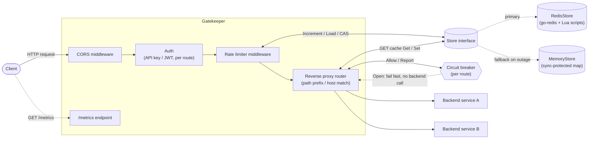
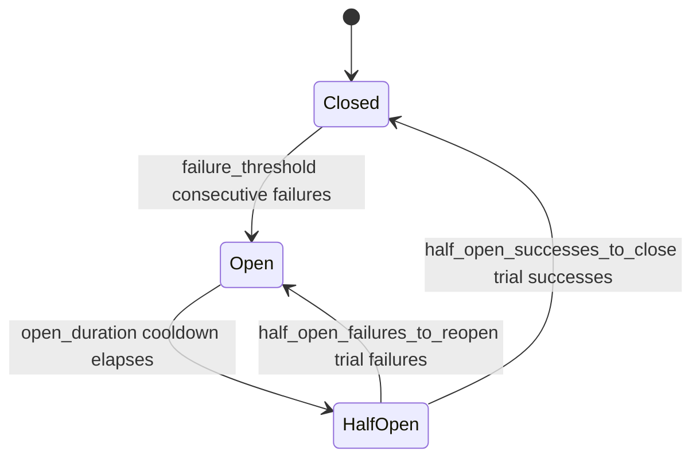

<p align="center">
  
</p>

# Gatekeeper

[](https://github.com/Deipedra34/Gatekeeper/actions/workflows/ci.yml)

Gatekeeper is a rate limiter and API gateway written in Go. It sits in front of your backend services, decides which requests get through based on per-client limits, and proxies the rest to wherever they're supposed to go. Metrics and graceful degradation come standard, not bolted on afterward.

I built it as a reference implementation more than a one-off tool. All three rate-limiting algorithms you'd actually reach for in production — Token Bucket, Sliding Window Log, Fixed Window Counter — run against the same storage abstraction, so switching one for another (or memory for Redis) is a config change, not a rewrite.

## Features

- **Three pluggable rate-limiting algorithms.** Token Bucket, Sliding Window Log, Fixed Window Counter, selectable via config, all built on one `Store` interface.
- **Two storage backends.** An in-memory map for single-instance deployments, or Redis when you need limits coordinated across a fleet.
- **Reverse proxy core.** Routes requests to backend services by path prefix or hostname, using `net/http/httputil.ReverseProxy` under the hood.
- **Configurable backend timeout and retry.** Every backend attempt is bounded by a per-attempt timeout; a timeout, connection failure, or 5xx response is retried with exponential backoff and jitter, up to a configurable limit. 4xx responses are never retried.
- **A normal middleware chain.** Rate limiting, request logging, API key / JWT auth, and CORS, composed the same way you'd compose any `net/http` middleware.
- **API keys and JWTs, per route.** Each route requires an API key, a JWT (HS256 or RS256), or either one. Existing configs keep plain API key auth without any changes.
- **Per-client tiers.** Limits scoped by API key, source IP, a custom header, or a JWT claim, with independent free/premium/whatever tiers defined in config (or picked by a JWT claim).
- **A Prometheus-compatible `/metrics` endpoint.** Requests allowed/rejected per client and tier, current limiter state, request latency histograms, cache hits/misses per route, circuit breaker state and rejections per route, auth successes/failures by method.
- **Response caching for GET requests.** Backend responses are cached per route in the same storage backend the rate limiter uses (memory or Redis), with a configurable TTL, an opt-out per route, and a header to bypass the cache for debugging.
- **A circuit breaker around every backend call.** Closed / Open / Half-Open, configurable per route, so a struggling backend gets a break from traffic instead of every request queuing up behind retries and timeouts.
- **Dynamic config reload.** `SIGHUP` re-reads the config file and swaps routes, rate-limit rules, tiers, and algorithm into the running gateway atomically — no restart, no dropped requests. An invalid config is logged and ignored, leaving the old one in place.
- **Graceful degradation.** If Redis goes down — at startup or mid-run — Gatekeeper falls back to in-memory limiting and logs a warning instead of taking the gateway down with it.

## Architecture


```mermaid
flowchart LR
    Client([Client])

    subgraph GW["Gatekeeper"]
        direction TB
        CORS["CORS middleware"]
        Auth["Auth\n(API key / JWT, per route)"]
        RL["Rate limiter middleware"]
        Proxy["Reverse proxy router\n(path prefix / host match)"]
        Metrics["/metrics endpoint"]

        CORS --> Auth --> RL --> Proxy
    end

    Store[("Store interface")]
    Mem[("MemoryStore\n(sync-protected map)")]
    Redis[("RedisStore\n(go-redis + Lua scripts)")]
    CB{{"Circuit breaker\n(per route)"}}

    Client -->|HTTP request| CORS
    RL <-->|Increment / Load / CAS| Store
    Proxy <-->|GET cache Get / Set| Store
    Store -.->|primary| Redis
    Store -.->|fallback on outage| Mem

    Proxy <-->|Allow / Report| CB
    CB -.->|Open: fail fast, no backend call| Proxy
    Proxy --> BackendA["Backend service A"]
    Proxy --> BackendB["Backend service B"]

    Client -.->|GET /metrics| Metrics
```

Every request runs through the same chain: CORS, then auth (API key or JWT, depending on the route), then the rate limiter, then the proxy. The limiter and the proxy don't know about each other — the limiter just needs a client key and a `Store`, the proxy just needs a routing table — so you can test, swap, or reason about either one on its own.

### Package layout

```
cmd/gatekeeper/        entrypoint: wires storage + metrics, runs the server, handles signals
internal/gateway/      assembles the request pipeline from config; rebuilds and swaps it on SIGHUP
internal/config/       YAML config loading, defaults, and validation
internal/ratelimiter/  the three algorithms + the Store abstraction they share
  └─ store/            MemoryStore, RedisStore, and FallbackStore (Redis → memory failover)
internal/proxy/        the reverse-proxy router (path prefix / hostname matching), backend timeout + retry/backoff, GET response caching, circuit breaker integration
internal/cache/        the response cache: key derivation, Cache-Control handling, Store-backed get/set
internal/circuitbreaker/ the Closed/Open/Half-Open state machine wrapped around each route's backend calls
internal/middleware/   logging, CORS, API key + JWT auth, rate-limit middleware
internal/metrics/      Prometheus collectors + /metrics handler
configs/                example config.yaml
scripts/loadtest/      goroutine-based load generator (see "Load testing" below)
```

## Rate-limiting algorithms: trade-offs

`ratelimiter.Limiter` has three implementations. All of them read the same two config knobs per tier — `requests_per_second` and `burst` — but they don't interpret those knobs the same way (see the doc comment on `ratelimiter.Rule` if you want the exact mapping).

| Algorithm | How it works | Accuracy | Cost | Trade-off |
|---|---|---|---|---|
| **Token Bucket** | Each client has a bucket of `burst` tokens that refills continuously at `requests_per_second`. Each request costs one token. | Smooth, no boundary weirdness. Bursts up to `burst` go through immediately; the sustained rate converges to whatever you configured. | O(1) storage per client (a float token count plus a timestamp), one optimistic CAS retry loop per request. | The default I'd reach for most of the time. Costs a bit more CPU and storage than Fixed Window because of the CAS loop and float math, but it's rarely the bottleneck. |
| **Sliding Window Log** | Every allowed request's timestamp gets logged. A request is allowed only if fewer than `burst` timestamps are still inside the trailing 1-second window. | Exact. There's no "more correct" than this one — no boundary doubling, ever. | O(`burst`) storage per client (one timestamp per request in the window) and O(`burst`) work per check just to prune the log. | The most precise option, but also the priciest. For high-limit tiers you're storing hundreds of timestamps per client and shipping that blob to Redis on every request. Works best when `burst` stays modest. |
| **Fixed Window Counter** | Time gets sliced into aligned 1-second windows; each client has one counter per window that resets on rollover. | The weakest guarantee of the three: a client can send `burst` requests at the very end of one window and another `burst` right at the start of the next — up to 2x the configured limit in a short span (`TestFixedWindow_BoundaryCanDoubleAllowedRequests` shows exactly this). | By far the cheapest: one atomic `INCR`-style op per request, O(1) storage. | Reach for this when throughput matters more than fairness at the margins — a coarse global ceiling rather than a strict per-client promise. |

All three share the same `Store` interface (`Increment`, `Load`, `CompareAndSwap`), so switching `rate_limit.algorithm` in config is the only thing you need to change to try a different trade-off against the same storage backend.

## Storage backends

- **`memory`** (default) — a `sync.Mutex`-protected map, local to the process. Fastest option, no external dependencies, but each instance enforces its own limit. Fine if you're running one instance, wrong if you're behind a load balancer.
- **`redis`** — counters live in Redis via [go-redis](https://github.com/redis/go-redis), so every instance behind that load balancer enforces one shared limit per client. `Increment` and `CompareAndSwap` are each a single Lua script, so the read-modify-write is atomic as far as Redis is concerned.

### Graceful degradation

When `storage.backend: redis` is set, Gatekeeper wraps the Redis store in a `FallbackStore`:

- At startup it pings Redis. If that fails, it logs a warning and just starts in fallback mode instead of refusing to boot.
- At runtime, any Redis error on a request sends that request (and everything after it) to the in-memory store, with a warning logged once per outage rather than once per request.
- A background check pings Redis every 5 seconds. Once it's back, Gatekeeper logs the recovery and starts using it again.

The trade-off while Redis is down: limits become per-instance instead of fleet-wide, same as if you'd configured `memory` in the first place — until Redis comes back. What doesn't happen is a crash or a gateway that stops responding.

## Backend request timeout and retry

Every request the proxy forwards to a backend is bounded by `proxy.timeout` and, if it fails, retried according to `proxy.retry` — both configurable in `configs/config.yaml`:

```yaml
proxy:
  timeout: 5s          # per-attempt timeout (default: 5s)
  retry:
    max_retries: 3     # additional attempts after the first (default: 3)
    base_backoff: 100ms # delay before the first retry (default: 100ms)
    max_backoff: 2s      # cap on the backoff delay (default: 2s)
```

All four fields are optional; any left unset get the defaults shown above.

- **Timeout** applies per attempt, not to the whole request — a request that ends up retrying 3 times can take up to roughly `4 × timeout` plus backoff delays in the worst case, not just `timeout`.
- **Retries** kick in only for failures a retry can plausibly fix: a timed-out attempt, a connection error (backend down/unreachable), or a `5xx` response. A **`4xx` response is never retried** — it means the backend understood the request and rejected it, and sending the same request again wouldn't change that.
- **Backoff** is exponential with jitter: the delay before retry *n* is `min(base_backoff × 2^(n-1), max_backoff)`, then a random value between 0 and that number is actually used, so many clients retrying at once don't all hit the backend in the same instant.
- The request body is buffered so it can be replayed identically on every retry attempt.
- If every attempt fails, the proxy returns whatever the last attempt produced: the backend's own `5xx` if that's what kept coming back, or a `502 Bad Gateway` if the backend was unreachable.

**Interaction with rate limiting and metrics:** the rate limiter middleware sits in front of the proxy and only ever sees the original incoming request once, so retries against the backend never cost a client extra rate-limit budget — a request that retries twice before succeeding still counts as exactly one allowed request against that client's limit. Retry attempts and final outcomes are tracked as their own metrics, separate from the raw allow/reject counters (see [Metrics](#metrics) below).

## Circuit breaker

Every route's backend calls go through a circuit breaker with three states:

- **Closed** — normal operation. Requests go to the backend as usual; failures are counted.
- **Open** — the backend has failed too many times in a row. Every request is **failed fast** with `503 Service Unavailable` — the backend is never contacted at all — until the configured cooldown elapses.
- **Half-Open** — after the cooldown, a limited number of trial requests are let through to check whether the backend has recovered. Everything else still fails fast while a trial is in flight.


```mermaid
stateDiagram-v2
    [*] --> Closed
    Closed --> Open: failure_threshold consecutive failures
    Open --> HalfOpen: open_duration cooldown elapses
    HalfOpen --> Closed: half_open_successes_to_close trial successes
    HalfOpen --> Open: half_open_failures_to_reopen trial failures
```

**What counts as a failure** is the same definition the retry logic uses: a timed-out attempt, a connection error, or a `5xx` response. A `4xx` response counts as a *success* for the breaker's purposes — the backend answered the request correctly, it just didn't like what the client sent, which says nothing about the backend's health. Any success (including a `4xx`) resets the consecutive-failure count while Closed.

**Configuration** — per route, in `configs/config.yaml`:

```yaml
routes:
  - path_prefix: "/api/users"
    target: "http://localhost:9001"
    circuit_breaker:
      enabled: true                        # default: true
      failure_threshold: 5                 # default: 5 consecutive failures
      open_duration: 30s                   # default: 30s cooldown
      half_open_max_requests: 1            # default: 1 concurrent trial
      half_open_successes_to_close: 1      # default: 1 trial success closes it
      half_open_failures_to_reopen: 1       # default: 1 trial failure reopens it
```

All fields are optional; omitting `circuit_breaker` entirely gives you the defaults shown above. Set `enabled: false` to exempt a route from circuit breaking altogether — for a backend where you'd always rather wait/retry than ever get a fast-fail 503, for instance.

**Interaction with retries.** The breaker is checked before every attempt a request makes, not just once per incoming request — so if a request's first attempt fails and pushes the breaker from Closed to Open, its *own* second attempt (and any further retries) sees the Open circuit and fails fast immediately: **no retry is made into an already-open circuit**. That fail-fast check happens before the retry's backoff delay too, so a circuit that's already open doesn't even pay the backoff wait before giving up. A circuit-open rejection isn't counted as a retry attempt in `gatekeeper_proxy_retries_total`, and it doesn't consume any of `proxy.retry.max_retries` — it's a distinct outcome from a retried-and-failed backend call, tracked in its own metric (see below). Like retries, this all happens below the rate limiter middleware, so a fast-failed request still counts as exactly one allowed request against the client's rate limit, same as any other outcome.

## Response caching

Gatekeeper caches `GET` responses per route, so repeated requests for the same resource are answered directly without touching the backend at all.

**How it's keyed.** A cache entry is keyed on the route, the backend target, the request method, the full URL (path + query string), and a few request headers that can legitimately change the response body for the same URL: `Authorization`, `X-API-Key`, and `Accept`. Two requests only share a cache entry if all of those match — different API keys, different query strings, or a different `Accept` value each get their own entry. Keying on the backend target as well as the route means a `SIGHUP` reload that repoints a route at a different backend can never serve a stale entry cached under the old one.

**What gets cached.** Only `GET` responses with a `200` status. A backend response carrying `Cache-Control: no-store` is never cached, no matter the route's configuration — every request for it reaches the backend. Anything other than `GET` (`POST`, `PUT`, `DELETE`, ...) always goes straight to the backend; caching never applies to it.

**Configuration** — per route, in `configs/config.yaml`:

```yaml
routes:
  - path_prefix: "/api/users"
    target: "http://localhost:9001"
    cache:
      enabled: true   # default: true — set false to opt this route out entirely
      ttl: 30s        # default: 60s
```

Both fields are optional. Omitting `cache` entirely gives you caching enabled with the default 60s TTL; set `enabled: false` for routes that must never be cached (anything with side effects on `GET`, or responses that are personalized in a way the cache key doesn't account for).

**Bypassing the cache.** Send `X-Bypass-Cache` (any non-empty value) on a request to skip the cache entirely for that one request — no read, no write — useful for confirming what the backend itself currently returns without waiting out the TTL or disabling caching for everyone else. Every cacheable response also carries an `X-Cache: HIT` or `X-Cache: MISS` header, so you can tell which path served a given response.

**Storage and graceful degradation.** Cached entries live in the same storage backend configured under `storage:` — the in-memory map, or Redis via the same `FallbackStore` the rate limiter uses. That means a Redis outage degrades caching exactly the way it degrades rate limiting: reads and writes fail open (skip the cache, go to the backend) rather than erroring or crashing the gateway, with a warning logged. A cache hit is served before the request ever reaches the proxy's retry transport, so it never triggers a backend retry and never costs an extra backend call.

**Interaction with rate limiting:** caching sits behind the rate limiter in the middleware chain, so a cached response still consumes the client's rate-limit budget exactly like an uncached one — caching saves the backend a request, not the client their quota.

## JWT authentication

Besides API keys, Gatekeeper can authenticate requests with a JSON Web Token sent as `Authorization: Bearer <token>`. Which credential a route requires is set per route, so API key clients and JWT clients can share one gateway.

### Auth modes

Each route gets an `auth_mode`:

| `auth_mode` | Accepts | On failure |
|---|---|---|
| `api_key` (default) | A valid key in `auth.header` (`X-API-Key` by default) | `401`, body `invalid or missing API key`, the same response as before JWT support existed |
| `jwt` | A valid bearer token | `401` + `WWW-Authenticate: Bearer` challenge, body `unauthorized` |
| `either` | A valid API key **or** a valid bearer token (the API key is checked first) | `401` + `WWW-Authenticate: Bearer` challenge, body `unauthorized` |

A route without `auth_mode` uses `api_key`, so **existing configs keep working unchanged**. `auth.enabled` is still the master switch: when it's `false`, every route is open whatever its `auth_mode` says. Gatekeeper logs a warning at startup and on reload if any route asks for `jwt` or `either` while auth is off. On an `either` route you can leave `auth.api_keys` empty, and the route then accepts JWTs only.

The auth middleware uses the same route matching as the proxy (host first, then longest path prefix), so a request is always authenticated under the rules of the route it's sent to. A request that matches no route is treated as `api_key` and then gets a `404` from the router.

### Configuration

```yaml
auth:
  enabled: true
  header: "X-API-Key"
  api_keys: ["demo-free-key", "demo-premium-key"]
  jwt:
    algorithm: HS256                 # HS256 or RS256; tokens using any other alg are rejected
    secret_env: GATEKEEPER_JWT_SECRET  # HS256: env var holding the secret (or `secret:` inline)
    # public_key_file: "keys/jwt-public.pem"   # RS256: PEM-encoded RSA public key
    issuer: "https://auth.example.com" # optional: required `iss` value
    audience: "gatekeeper"             # optional: required `aud` value
    leeway: 30s                        # optional: clock skew allowed for exp/nbf
    client_id_claim: sub               # claim that identifies the client (default: sub)
    tier_claim: tier                   # optional: claim that picks the rate-limit tier

routes:
  - path_prefix: "/api/users"
    target: "http://localhost:9001"      # no auth_mode: API key only, as before
  - path_prefix: "/api/orders"
    target: "http://localhost:9002"
    auth_mode: either
  - path_prefix: "/internal"
    target: "http://localhost:9003"
    auth_mode: jwt
```

| Field | Notes |
|---|---|
| `algorithm` | `HS256` (shared secret) or `RS256` (RSA public key). Only this algorithm is accepted, which blocks algorithm-confusion attacks: a token with `alg: none`, or an HS256 token signed with your RS256 public key as its HMAC secret, is rejected before any key is used. |
| `secret` / `secret_env` | HS256 only. Set exactly one. Prefer `secret_env` so the secret never sits in the config file. The secret must be at least 32 bytes (RFC 7518's minimum for HS256). |
| `public_key_file` | RS256 only. A PEM `PUBLIC KEY` or `RSA PUBLIC KEY` of at least 2048 bits. A relative path resolves against the gateway's working directory. The file is read at startup and on each `SIGHUP` reload, so a reload picks up a rotated key. A missing or invalid key fails startup, and fails a reload while the old config keeps serving. |
| `issuer`, `audience` | When set, the token's `iss` must match, and one of its `aud` values must match. When unset, those claims aren't checked. |
| `leeway` | Clock skew tolerated when checking `exp` and `nbf`. Default `0s`. |
| `client_id_claim` | Default `sub`. Must be a non-empty string, or the token is rejected. |
| `tier_claim` | Optional. See below. |

Every token must have an `exp` claim, and tokens without one are rejected. A token with `nbf` in the future is rejected too. Gatekeeper never logs tokens or secrets: the request log records only method, path, status, duration and remote address, and config errors name the setting at fault but not its value.

### Rate limiting and tiers from claims

When a request authenticates with a JWT, the rate limiter identifies the client by the `client_id_claim` value instead of `rate_limit.scope`. The value is prefixed with `jwt:`, so a token with `sub: alice` gets its own `jwt:alice` bucket and appears as `client="jwt:alice"` in `/metrics`. The prefix means a token can never share, or drain, the bucket of an API key, IP or header value that happens to be the same string.

If `tier_claim` is set, that claim's value picks the tier directly, so `"tier": "premium"` gets the `premium` limits from `rate_limit.tiers`. The client falls back to the `default` tier when the claim is missing, isn't a string, or names a tier that isn't configured. A token can't invent its own tier. The `rate_limit.clients` map only applies to API key, IP and header clients, not to JWT clients.

Requests authenticated by API key, including API key requests on an `either` route, are rate-limited exactly as before.

The response cache already includes the `Authorization` header in its key (see [Response caching](#response-caching)), so two JWT holders never get each other's cached responses.

### Error responses

A missing token gets a challenge without an error code, and a bad token gets `error="invalid_token"` (RFC 6750):

```
HTTP/1.1 401 Unauthorized
WWW-Authenticate: Bearer realm="gatekeeper", error="invalid_token"

unauthorized
```

The body is the same whether the token was expired, badly signed, issued for another audience or malformed, so it gives an attacker nothing to probe with.

### Trying it out

Generate a test HS256 token with nothing but `openssl` (bash, Git Bash or WSL). The secret must match the gateway's:

```bash
export GATEKEEPER_JWT_SECRET='replace-me-with-a-random-secret-of-32-bytes-or-more'

b64url() { openssl base64 -A | tr '+/' '-_' | tr -d '='; }
header=$(printf '{"alg":"HS256","typ":"JWT"}' | b64url)
payload=$(printf '{"sub":"alice","tier":"premium","aud":"gatekeeper","iss":"https://auth.example.com","exp":%d}' \
  "$(( $(date +%s) + 3600 ))" | b64url)
sig=$(printf '%s.%s' "$header" "$payload" | openssl dgst -sha256 -hmac "$GATEKEEPER_JWT_SECRET" -binary | b64url)
TOKEN="$header.$payload.$sig"
```

Start the gateway in the same shell, so it sees `GATEKEEPER_JWT_SECRET`, with a config like the one above. Then:

```bash
curl -i http://localhost:8080/api/orders/42 -H "Authorization: Bearer $TOKEN"
```

```
HTTP/1.1 200 OK
X-Ratelimit-Limit: 100
X-Ratelimit-Remaining: 99
```

The `premium` limit applies because of the `tier` claim. The same route still takes an API key, because it's an `either` route:

```bash
curl -i http://localhost:8080/api/orders/42 -H "X-API-Key: demo-free-key"
```

For RS256, sign with a private key and give the gateway the matching public key:

```bash
openssl genpkey -algorithm RSA -pkeyopt rsa_keygen_bits:2048 -out jwt-private.pem
openssl pkey -in jwt-private.pem -pubout -out jwt-public.pem   # -> auth.jwt.public_key_file

header=$(printf '{"alg":"RS256","typ":"JWT"}' | b64url)
sig=$(printf '%s.%s' "$header" "$payload" | openssl dgst -sha256 -sign jwt-private.pem -binary | b64url)
TOKEN="$header.$payload.$sig"
```

In production, tokens come from your identity provider. Keep only the public key on the gateway for RS256, and never commit HS256 secrets or private keys.

## Setup

Requires Go 1.26+ (see `go.mod`). Redis is optional, only needed if you set `storage.backend: redis`.

```bash
git clone <this-repo>
cd gatekeeper
go build -o bin/gatekeeper ./cmd/gatekeeper
```

Edit [`configs/config.yaml`](configs/config.yaml) so `routes` points at your actual backend services, then run:

```bash
./bin/gatekeeper -config configs/config.yaml
```

By default Gatekeeper listens on `:8080` and exposes metrics on `/metrics`.

### Windows launchers

Two `.bat` files are included so you don't have to type any of the above by hand:

- **[`start.bat`](start.bat)** — builds and runs the real `gatekeeper` binary against `configs/config.yaml`. Edit that config's `routes` first so they point at real services. No demo backend, no dashboard — this is the production-shaped path.
- **[`start-demo.bat`](start-demo.bat)** — a self-contained demo. Builds a throwaway stand-in backend and Gatekeeper, starts both, and opens an interactive dashboard in your browser (`-dashboard` flag, served by Gatekeeper itself at `/_dashboard`). Pick a client — free, premium, or no key — fire a single request or a burst of concurrent ones, and watch allowed vs. rate-limited counts update live next to `/metrics`. Good for seeing the limiter actually do something without wiring up real services first.

## Dynamic config reload (SIGHUP)

Gatekeeper re-reads its config file on `SIGHUP`, so you can change routes,
rate-limit rules, client tiers, the algorithm, and the auth/CORS settings
without restarting the process or dropping in-flight requests.

Edit `configs/config.yaml` (the same path passed to `-config`), then:

```bash
kill -HUP <pid>
```

On reload Gatekeeper re-parses and validates the file, builds a fresh
routing table and set of per-tier limiters, and swaps them in atomically.
A request in flight during the swap finishes on the config it started
with; the next request uses the new one. Rate-limit counter state is kept
across the reload rather than reset.

If the new config is missing, malformed, or fails validation, the reload
is **rejected**: Gatekeeper logs the error and keeps serving with the
previous config. It never crashes or serves a half-applied config.

```
gatekeeper: SIGHUP received, reloading config
gatekeeper: config reload failed, keeping previous config: config: invalid: rate_limit.tiers.free.burst must be > 0
```

`server.*`, `storage.*`, and `metrics.*` are read only at startup —
changing the listen address, the storage backend, or the metrics path
still requires a restart.

## Run with Docker

A multi-stage [`Dockerfile`](Dockerfile) is included: it builds the `gatekeeper` binary in a `golang:1.26-alpine` stage, then copies just the binary and `configs/config.yaml` into a minimal `alpine` runtime image.

Build the image:

```bash
docker build -t gatekeeper .
```

Run it with the bundled config:

```bash
docker run --rm -p 8080:8080 gatekeeper
```

To use your own config instead of the one baked into the image, mount it over the in-image path:

```bash
docker run --rm -p 8080:8080 \
  -v "$(pwd)/configs/config.yaml:/app/configs/config.yaml:ro" \
  gatekeeper
```

If `routes` in your config point at services on the host (e.g. `localhost:9000`), remember that `localhost` inside the container refers to the container itself. On Docker Desktop (Mac/Windows), point routes at `host.docker.internal` instead; on Linux, add `--add-host=host.docker.internal:host-gateway` to the `docker run` command or use `--network host`.

The image exposes port `8080`, matching the default `server.listen_addr` in [`configs/config.yaml`](configs/config.yaml) — adjust the `-p` mapping if you change that value.

## Run the full stack with Docker Compose

[`docker-compose.yml`](docker-compose.yml) brings up a complete, self-contained stack so you can exercise the whole gateway — routing, auth, rate limiting, and Redis-backed counters — without standing up any real backend services first:

- **`gatekeeper`** — built from the [`Dockerfile`](Dockerfile), same as above.
- **`redis`** (`redis:alpine`) — backs the rate limiter's shared counters.
- **`mock-backend`** — a tiny standalone HTTP server in [`mockbackend/`](mockbackend/) that echoes back the request it received as JSON, standing in for a real upstream so requests have somewhere to be proxied to.

Gatekeeper runs against [`configs/config.docker.yaml`](configs/config.docker.yaml) inside the stack (mounted over the image's baked-in config), not `configs/config.yaml`. It's identical except `storage.redis.addr` points at `redis:6379` and every route's `target` points at `http://mock-backend:9000` — both reached by their compose service name rather than `localhost`, since each service is its own container on the compose network.

Start everything with:

```bash
docker-compose up --build
```

Only `gatekeeper` publishes a port to the host — `8080`, matching `server.listen_addr`. `redis` and `mock-backend` are reachable from `gatekeeper` on the compose network but not from the host.

Once the stack is up, hit it the same way as [Example usage](#example-usage) below, just via `docker-compose` instead of a locally built binary:

```bash
curl -i http://localhost:8080/api/ping -H "X-API-Key: demo-free-key"
```

```
HTTP/1.1 200 OK
X-Ratelimit-Limit: 10
X-Ratelimit-Remaining: 9

{"message":"hello from mock-backend","method":"GET","path":"/api/ping", ...}
```

The JSON body comes from `mock-backend`, confirming the request actually made it through Gatekeeper's auth and rate-limit middleware and was proxied end-to-end. Send more than 10 requests in quick succession with the same key and you'll start getting `429 Too Many Requests` back, same as in [Example usage](#example-usage). `curl http://localhost:8080/metrics` and the gateway's own logs (`docker-compose logs gatekeeper`) work as usual too.

## Example usage

Using the example config's `demo-free-key` (free tier: 5 req/s, burst 10) against a route proxying `/api/*` to a backend:

```bash
curl -i http://localhost:8080/api/ping -H "X-API-Key: demo-free-key"
```

```
HTTP/1.1 200 OK
X-Ratelimit-Limit: 10
X-Ratelimit-Remaining: 9

pong
```

Every response carries `X-RateLimit-Limit` / `X-RateLimit-Remaining`. Once the tier's allowance is gone, Gatekeeper answers directly without ever touching the backend:

```bash
curl -i http://localhost:8080/api/ping -H "X-API-Key: demo-free-key"
```

```
HTTP/1.1 429 Too Many Requests
Retry-After: 1

rate limit exceeded
```

### Metrics

```bash
curl http://localhost:8080/metrics
```

```
gatekeeper_limiter_remaining{client="demo-free-key",tier="free"} 0
gatekeeper_limiter_remaining{client="demo-premium-key",tier="premium"} 0
gatekeeper_requests_allowed_total{client="demo-free-key",tier="free"} 11
gatekeeper_requests_allowed_total{client="demo-premium-key",tier="premium"} 102
gatekeeper_requests_rejected_total{client="demo-free-key",tier="free"} 190
gatekeeper_requests_rejected_total{client="demo-premium-key",tier="premium"} 98
gatekeeper_proxy_retries_total{route="/api"} 4
gatekeeper_proxy_request_outcomes_total{route="/api",outcome="success"} 108
gatekeeper_proxy_request_outcomes_total{route="/api",outcome="failure"} 3
gatekeeper_cache_hits_total{route="/api"} 76
gatekeeper_cache_misses_total{route="/api"} 32
gatekeeper_circuit_breaker_state{route="/api"} 0
gatekeeper_circuit_breaker_rejections_total{route="/api"} 0
gatekeeper_auth_requests_total{method="api_key",result="success"} 213
gatekeeper_auth_requests_total{method="api_key",result="failure"} 4
gatekeeper_auth_requests_total{method="jwt",result="success"} 57
gatekeeper_auth_requests_total{method="jwt",result="failure"} 2
```

`gatekeeper_proxy_retries_total` counts individual retry attempts against a backend (not the initial attempt), and `gatekeeper_proxy_request_outcomes_total` counts each proxied request exactly once — as `success` or `failure` — after all retries are done. Both are independent of `gatekeeper_requests_allowed_total`/`_rejected_total`, which reflect the rate limiter's decision on the original client request, not what happened while forwarding it.

`gatekeeper_cache_hits_total`/`gatekeeper_cache_misses_total` count cache-eligible `GET` requests per route — a hit was served without touching the backend, a miss reached the backend and (usually) refreshed the cache. Neither counter moves for a route with caching disabled, a non-`GET` request, or a request sent with `X-Bypass-Cache`.

`gatekeeper_circuit_breaker_state` reports each route's current breaker state as a number — `0` (closed), `1` (open), `2` (half-open) — so you can alert on a route sitting at `1` for longer than expected. `gatekeeper_circuit_breaker_rejections_total` counts requests that were failed fast because the breaker was open; these never reach the backend and are separate from `gatekeeper_proxy_request_outcomes_total`. Neither series appears for a route with circuit breaking disabled.

`gatekeeper_auth_requests_total` counts every auth decision once, by `method` (`api_key` or `jwt`) and `result` (`success` or `failure`). A rejected request on an `either` route counts as a `jwt` failure if it carried a bearer token and as an `api_key` failure otherwise. Nothing is counted while `auth.enabled` is false. See [JWT authentication](#jwt-authentication).

(`gatekeeper_request_duration_seconds` is also exposed as a histogram, alongside the usual Go/process collectors.)

### Grafana dashboard

[`grafana/gatekeeper-dashboard.json`](grafana/gatekeeper-dashboard.json) is a ready-to-import Grafana dashboard for these metrics. It shows allowed vs rejected requests per client and tier, rate-limit quota remaining, cache hit/miss ratio, latency percentiles and a latency histogram, and backend retry counts and outcomes.

<!-- TODO: Add a screenshot of the imported dashboard here. -->


> **Screenshot placeholder:** add a screenshot of the imported dashboard at `docs/images/grafana-dashboard.png`.

To use it:

1. Point a Prometheus instance at Gatekeeper's metrics endpoint (`<listen_addr><metrics.path>`, e.g. `localhost:8080/metrics`). The endpoint needs no API key.
2. In Grafana, go to **Dashboards → New → Import**, upload `grafana/gatekeeper-dashboard.json`, and pick that Prometheus data source from the **Data source** dropdown at the top of the dashboard.

To try it locally, an opt-in compose file runs Prometheus and Grafana next to the existing stack, with the dashboard already provisioned. Grafana is then at <http://localhost:3000> (`admin` / `admin`):

```bash
docker-compose -f docker-compose.yml -f docker-compose.monitoring.yml up --build
```

See [`grafana/README.md`](grafana/README.md) for the full walkthrough.

## Testing

```bash
go test ./...
```

What's covered:
- Each algorithm's correctness, including edge-of-burst behavior and concurrent goroutines hammering a single client — asserting the allowed count never sneaks past the configured burst (see `TestTokenBucket_ConcurrentRequestsNeverExceedBurst` for an example).
- A shared conformance suite (`store.testStoreConformance`) that runs against *both* `MemoryStore` and a `miniredis`-backed `RedisStore`, so the two backends are held to identical guarantees without needing a real Redis instance in CI.
- `FallbackStore` failover and recovery.
- Gateway routing: longest-path-prefix matching, host-based routing, a 404 when nothing matches, a 502 when the backend is dead.
- Backend timeout/retry: a request that succeeds on the first try, one that fails once then succeeds on retry, one that exhausts all retries and fails, a connection-refused backend being retried, and confirming a `4xx` response is never retried — including that retries never inflate the request's rate-limit cost.
- Response caching (`internal/cache` and `internal/proxy/cache_test.go`): a miss followed by a hit for the same request, TTL expiration forcing a fresh backend call, a `Cache-Control: no-store` response never being cached, `X-Bypass-Cache` skipping the cache without disturbing the existing entry, a route with caching disabled always reaching the backend, and caching degrading gracefully (fail open, no crash) when its store errors on every call — simulating Redis being down.
- Circuit breaker (`internal/circuitbreaker` and `internal/proxy/circuitbreaker_test.go`): tripping to Open after `failure_threshold` consecutive failures, requests failing fast (and never reaching the backend) while Open, transitioning to Half-Open once the cooldown elapses, a successful trial closing the breaker, a failed trial re-opening it, Half-Open's concurrent-trial limit, and confirming a request never retries into an already-open circuit.
- A full end-to-end test (`TestGateway_EndToEnd`) that wires config → storage → limiters → the whole middleware chain → the proxy, then drives it through auth, CORS, per-tier rate limiting, and routing together, not in isolation.

## Load testing

[`scripts/loadtest`](scripts/loadtest/main.go) is a small goroutine-based Go program that fires concurrent requests at a running Gatekeeper instance and reports how many got through versus rate-limited, plus latency percentiles.

```bash
go run ./scripts/loadtest -target http://localhost:8080/api/ping -api-key demo-free-key -requests 200 -concurrency 20
```

This is real output from a local run against the example config's `free` tier (5 req/s, burst 10), token-bucket algorithm, in-memory store:

```
Gatekeeper load test
=====================
requests:      200 (concurrency 20)
wall time:     33ms (6031.0 req/s)
allowed (2xx): 10
rejected (429):190
failed:        0

latency  min=0s  p50=1.61ms  p95=14.103ms  p99=17.202ms  max=17.84ms
```

Exactly 10 got through — the tier's configured burst — and the rest were rejected in that same wave of concurrent traffic, which is precisely what Token Bucket promises. Same run against the `premium` tier (50 req/s, burst 100):

```
Gatekeeper load test
=====================
requests:      200 (concurrency 20)
wall time:     54ms (3695.4 req/s)
allowed (2xx): 102
rejected (429):98
failed:        0

latency  min=0s  p50=2.447ms  p95=21.656ms  p99=22.16ms  max=22.674ms
```

102 allowed, not a round 100 — those extra 2 came from the bucket refilling at 50 tokens/sec during the ~54ms it took to send the burst. That's Token Bucket's continuous refill showing up in practice, as opposed to the hard cutoff you'd get from a Fixed Window Counter.

## Benchmarks

[`internal/ratelimiter/bench_test.go`](internal/ratelimiter/bench_test.go) benchmarks all three algorithms against both storage backends, driving `Limiter.Allow` in a tight sequential loop for a single client key. The Redis numbers run against [`miniredis`](https://github.com/alicebob/miniredis) — an in-process fake Redis reached over a real TCP loopback connection — so they capture the cost of the Lua round trip and payload serialization without requiring a live Redis instance to reproduce:

```bash
go test -bench=. -benchmem ./...
```

This is real output from a local run (Windows, 13th Gen Intel Core i7-13700HX):

```
goos: windows
goarch: amd64
pkg: gatekeeper/internal/ratelimiter
cpu: 13th Gen Intel(R) Core(TM) i7-13700HX
BenchmarkTokenBucket_Memory-24         	  787939	      1428 ns/op	     440 B/op	       9 allocs/op
BenchmarkTokenBucket_Redis-24          	    4186	    429837 ns/op	  219485 B/op	     845 allocs/op
BenchmarkSlidingWindowLog_Memory-24    	   10000	    304404 ns/op	   81168 B/op	      19 allocs/op
BenchmarkSlidingWindowLog_Redis-24     	    3078	    930296 ns/op	  422332 B/op	     867 allocs/op
BenchmarkFixedWindow_Memory-24         	 5546469	       194.3 ns/op	      48 B/op	       3 allocs/op
BenchmarkFixedWindow_Redis-24          	    3928	    302200 ns/op	  187867 B/op	     750 allocs/op
```

Summarized, with throughput derived from ns/op:

| Algorithm | Store | ns/op | B/op | allocs/op | Throughput (ops/sec) |
|---|---|--:|--:|--:|--:|
| Token Bucket | Memory | 1,428 | 440 | 9 | ~700,000 |
| Token Bucket | Redis | 429,837 | 219,485 | 845 | ~2,300 |
| Sliding Window Log | Memory | 304,404 | 81,168 | 19 | ~3,300 |
| Sliding Window Log | Redis | 930,296 | 422,332 | 867 | ~1,100 |
| Fixed Window Counter | Memory | 194.3 | 48 | 3 | ~5,150,000 |
| Fixed Window Counter | Redis | 302,200 | 187,867 | 750 | ~3,300 |

This lines up with the trade-offs described above. **Fixed Window Counter is the fastest and lightest by a wide margin** — a single atomic increment and O(1) storage, no CAS loop — at the cost of the boundary-doubling behavior described earlier. **Token Bucket sits in the middle**: its CAS loop and float refill math cost roughly 7x Fixed Window on the memory store, but its per-client state stays a fixed size regardless of burst, so that cost doesn't grow with configured limits. **Sliding Window Log is the memory-heaviest of the three**, and it shows: on the memory store it's already ~200x slower than Fixed Window and allocates ~1.7KB per call, because every `Allow` has to unmarshal, prune, and re-marshal a per-client log of up to `burst` timestamps — exactly the O(burst) cost the trade-off table above calls out.

The Redis numbers tell a second, independent story: every algorithm gets roughly 300–1000x slower once state has to round-trip a Lua script over the network instead of staying behind a local mutex, which is the real cost of coordinating limits fleet-wide ([ADR 2](docs/adr/0002-redis-lua-atomic-operations.md)) — and it's also why [`FallbackStore`](docs/adr/0004-fallback-store-graceful-degradation.md) existing at all matters: losing Redis costs you fleet-wide accuracy, but staying on it costs raw throughput even when it's healthy.

## Architecture Decisions

Short records of the reasoning behind Gatekeeper's key architectural choices — why Token Bucket is the default, why Redis coordination uses Lua scripts, why storage sits behind a `Store` interface, why `FallbackStore` exists — live in [`docs/adr/`](docs/adr/).

## Configuration reference

See the fully-commented [`configs/config.yaml`](configs/config.yaml) for every field. The shape at a glance:

```yaml
server:      { listen_addr, read_timeout, write_timeout, idle_timeout }
storage:     { backend: memory|redis, redis: { addr, password, db, dial_timeout } }
rate_limit:  { algorithm, scope: api_key|ip|header, header_name, tiers: {...}, clients: {...} }
auth:        { enabled, header, api_keys: [...], jwt: { algorithm: HS256|RS256, secret | secret_env, public_key_file, issuer, audience, leeway, client_id_claim, tier_claim } }
cors:        { enabled, allowed_origins, allowed_methods, allowed_headers, allow_credentials, max_age }
routes:      [ { path_prefix | host, target, auth_mode: api_key|jwt|either, cache: { enabled, ttl }, circuit_breaker: { enabled, failure_threshold, open_duration, half_open_max_requests, half_open_successes_to_close, half_open_failures_to_reopen } } ]
metrics:     { enabled, path }
proxy:       { timeout, retry: { max_retries, base_backoff, max_backoff } }
```

---

<p align="center"><i>-by Deipedra</i></p>
